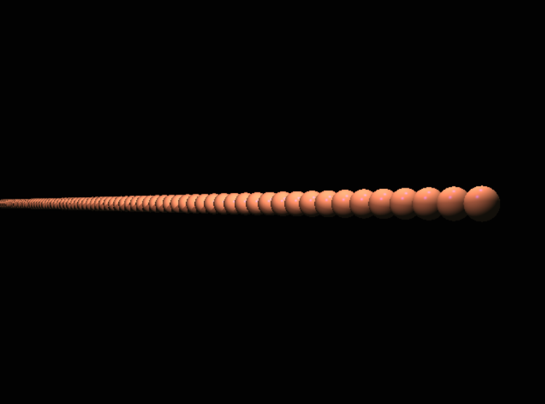
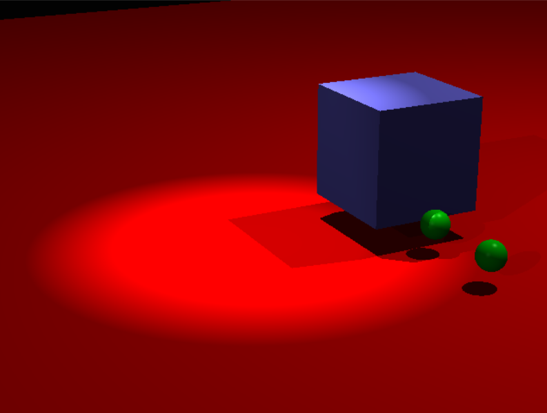
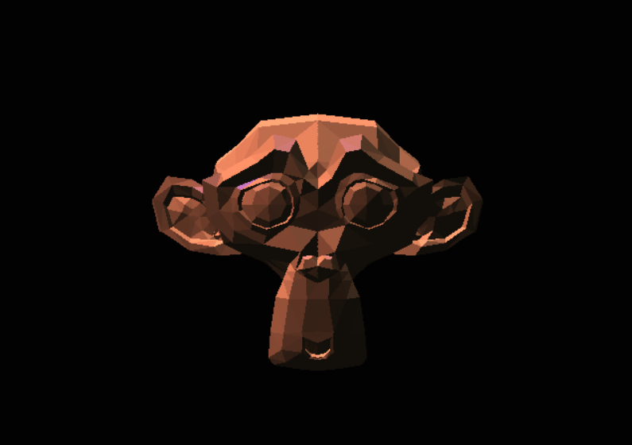

# Real-time concurrent CPU ray tracer

## Aim

This project is aimed to create a real-time ray tracer program on the CPU, utilizing the wide possibilities for parallelization.
Blinn-Phong reflection model is used as a backbone of lighting effects.
Ray-objects intersection testing is conducted using the Möller–Trumbore algorithm for triangles and simple linear algebra operations for plains, spheres, and ellipses.
Global and local view concepts are introduced to implement the 3D object sizing, rotation, and positioning.
To reproduce the properties of the camera, such as field of view and perspective, the camera obscura model is used.

## Prerequisites

You need to have C++ std lib installed. You will also need `gcc` or `clang` compiler, `cmake` and `make` installed to build the project.

Additionally, SDL2, TBB, and glm libraries are required.

We use SDL2 library as an API for computer multimedia hardware.
Intel Threading Building Blocks is used to utilize the parallelization.
OpenGL Mathematics (GLM) provides a mathematical backbone for our application. 

## Compilation

Our project uses CMake as a build system. To compile the project, run the following commands:

```bash
cmake -S . -B build -DCMAKE_BUILD_TYPE=Release
cmake --build build
```

### Installation

To install the project, run the following commands:

```bash
cmake -S . -B build -DCMAKE_BUILD_TYPE=Release
cmake --build build --target install
```


## Usage

To start the program just run the executable file:
```bash
    cd ./cmake-build-release
    ./Ray_Tracer
```

### Controls

There are controls for the camera:

* `W` - move forward
* `S` - move backward
* `A` - move left
* `D` - move right
* `Q` - move up
* `E` - move down
* `UP` - rotate up
* `DOWN` - rotate down
* `LEFT` - rotate left
* `RIGHT` - rotate right

### Gallery






